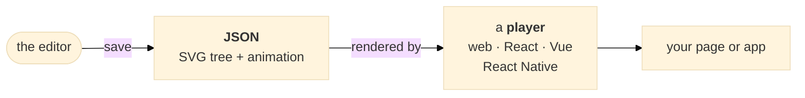
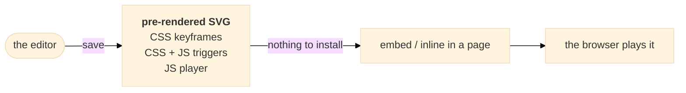
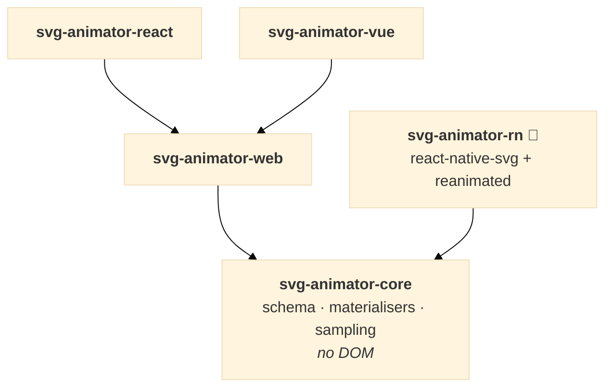

# Introduction

[← Contents](./README.md) · Next: [Choosing a format →](./02-start--choosing-a-format.md)

Pixodesk SVG Animator is an **editor** that makes SVG animations, a set of **players** that
run them, and the **file format** that connects the two. You make the animation once, save it
as a file, and that file plays anywhere SVG does.

**The editor** is a full-featured vector and animation tool. Draw shapes, paths and text, or
import SVG from Illustrator, Figma, Inkscape and the like. Animate any property on a timeline,
add effects, then save. It also imports and exports **Lottie**, and exports to video, GIF and
still images when you need a fallback. It ships as the *Pixodesk Animator Studio* desktop app
for Windows and Mac, from [pixodesk.com](https://pixodesk.com).

**The players** are small, open-source runtime libraries — MIT-licensed, published on npm as
`@pixodesk/svg-animator-*`, and developed in [this repository](../README.md). Pick the one for
where the animation runs: plain **HTML**, **React**, **Vue** or **React Native**. Control
playback from code — play, pause, seek, reverse, speed — or let the animation start itself on
load, click or scroll.

**The format** stays as close to plain SVG as it can, with a wide vector feature set. It comes
in two flavours. **JSON** is the source: the SVG tree plus its animation, read by a player.
**Pre-rendered SVG** is a normal `.svg` with the animation already inside, ready to embed or
inline straight into a page — as pure **CSS keyframes** with no JavaScript at all, the same
plus a small script for triggers, or with the **JS player** embedded and running on the engine
you choose, **WAAPI** or **frames**.

The two flavours take different routes to the screen:

## What it's good for

- Splash screens
- Animated backgrounds
- Icon animations
- Loaders
- Illustrations that react to hover, click or scroll
- Animated logos

Anything you would otherwise reach for a GIF, a video or a Lottie file for — but as crisp,
tiny, scalable SVG.

## JSON and pre-rendered SVG

**JSON** is the source format: a small document describing the SVG tree plus its animation.
A player library renders it and gives you complete runtime control — play, pause, seek,
reverse, speed — and supports every animation type on every browser. It is the right choice
for apps (React / Vue / React Native), for complex animations, and whenever you need to drive
the animation from code.

**Pre-rendered SVG** is a normal `.svg` file with the animation baked in. Drop it into any
page, CMS or static-site generator and it plays — no library needed for the CSS flavour. It is
the simplest option and the right one for most icons, loaders and decorative animation. Its
one rule: **inline a given file once per page** — its element ids are fixed, so a second copy
collides with the first ([why](./11-player--prerendered-svg.md#one-copy-of-a-file-per-page)). For several instances of one
animation, use JSON.

Both come out of the same editor document, and the editor converts between them at any time
(**File → Save as JSON / Save as SVG**), so the choice is never final.

## Which file format do I need?

Start from where the animation is going:

- **A page, a CMS, a static site — and you just want it to play.** Use a **pre-rendered SVG**.
  No package to install: paste it in or let your build tool inline it. Start at
  [Pre-rendered SVG on the web](./11-player--prerendered-svg.md).
- **An app, or anything you need to control from code.** Use **JSON** with the player for your
  stack. Start at [Installing the players (overview)](./05-player--installation.md).

| Your stack | Package |
|---|---|
| Vanilla JavaScript | `@pixodesk/svg-animator-web` |
| React / Next.js | `@pixodesk/svg-animator-react` |
| Vue / Nuxt | `@pixodesk/svg-animator-vue` |
| React Native / Expo 🧪 | `@pixodesk/svg-animator-rn` |
| Tooling that validates, transforms or samples documents without rendering | `@pixodesk/svg-animator-core` |

Still unsure? [Choosing a format](./02-start--choosing-a-format.md) has the side-by-side
comparison and what each engine can animate.

The React and Vue packages wrap the web player; every player shares the core, so the same
document produces the same frames everywhere:

## Where next

- Deciding on a format → [Choosing a format](./02-start--choosing-a-format.md)
- Learning the editor → [The editor](./03-editor--editor.md)
- Embedding a pre-rendered SVG → [Pre-rendered SVG on the web](./11-player--prerendered-svg.md)
- Installing a player → [Installing the players (overview)](./05-player--installation.md)
- Understanding the file → [Format principles](./13-format--format-principles.md), then the
  [JSON format reference](./14-format--json-format.md)

[← Contents](./README.md) · Next: [Choosing a format →](./02-start--choosing-a-format.md)
