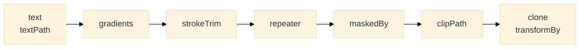

# Player effects

[← JSON format reference](./14-format--json-format.md) · [Contents](./README.md) · Next: [Editor meta and applied effects →](./16-format--editor-meta.md)

Reach for an effect when a single attribute is not enough. An **attribute** is a value the
browser consumes as-is; an **effect** is anything that needs *structure* — generated `<defs>`,
wrapper groups, copies, geometry-derived rewrites. Declare it on a node's `effects` bucket and
the player expands it when the document loads (JSON format only — the pre-rendered SVG exports
already contain the expanded structure).

```json
{ "type": "rect", "x": 0, "y": 0, "width": 40, "height": 40, "fill": "#3b82f6",
  "effects": {
    "transformBy": { "translate": [50, 50], "rotate": 30 },
    "repeater":    { "copies": 5, "translate": [80, 0], "rotate": 15 }
  } }
```

**Animatable slots.** Wherever a value is marked ✚ below it accepts three forms — a static
value, `{ "value": … }`, or a full property animation `{ "keyframes": [ … ], "loop"?: … }` — the
same grammar as the `animate` channel.

**Order.** Key order in `effects` carries no meaning; the player always composes in one fixed
order, innermost → outermost:



So `repeater` + `transformBy` on one element
always means "repeat, then transform the whole row"; for "transform each copy, then repeat",
put the `transformBy` on a child and the `repeater` on the parent group.

| Effect | What it does |
|---|---|
| [`transformBy`](#transformby) | per-part transforms with independent timing |
| [`repeater`](#repeater) | N copies, each stepped by a delta |
| [`maskedBy`](#maskedby) | mask by another element |
| [`clipPath`](#clippath) | clip to a (possibly animated) path |
| [`strokeTrim`](#stroketrim) | draw-on / draw-off along a stroke |
| [`clone`](#clone) | `<use>` semantics: what it copies, and re-timing |
| [`fillGradient` / `strokeGradient`](#fillgradient--strokegradient) | gradient paint with animatable stops and geometry |
| [`textPath`](#textpath) | text along a path |
| [`text`](#text) | glyph-outline text rendering |

## `transformBy`

Wraps the element in transform groups so each part has its **own timeline**. Use it when
translate and rotate (say) must run at different times — a single `transform` attribute has one
timeline for all parts.

| Key | Type | |
|---|---|---|
| `translate` | `[x, y]` ✚ | user units |
| `rotate` | number ✚ | degrees |
| `skew` | number ✚ | skewX degrees |
| `scale` | `[sx, sy]` ✚ | factors |
| `origin` | `[x, y]` ✚ | pivot |

```json
"effects": { "transformBy": {
  "translate": { "keyframes": [ { "time": 0,   "value": [0, 0] },   { "time": 500,  "value": [200, 0] } ] },
  "rotate":    { "keyframes": [ { "time": 500, "value": 0 },        { "time": 1000, "value": 360 } ] }
} }
```

## `repeater`

Materialises `copies` real copies of the element; copy *i* is offset by *i* × the deltas
(`scale` compounds: `scale^i`). The base element's own animation is copied too.

| Key | Type | |
|---|---|---|
| `copies` | number | static — the count cannot animate |
| `translate` | `[x, y]` ✚ | per-copy step |
| `rotate` | number ✚ | per-copy degrees |
| `skew` | number ✚ | per-copy skewX degrees |
| `scale` | `[sx, sy]` ✚ | per-copy factor (`0.85` = each copy 85 % of the previous) |
| `origin` | `[x, y]` ✚ | pivot for the per-copy rotate / scale |

```json
{ "type": "rect", "x": 0, "y": 0, "width": 30, "height": 30, "fill": "#6366f1",
  "animate": { "opacity": { "keyframes": [ { "time": 0, "value": 1 }, { "time": 1000, "value": 0.2 } ] } },
  "effects": { "repeater": { "copies": 4, "translate": [50, 0], "rotate": { "keyframes": [ { "time": 0, "value": 0 }, { "time": 1000, "value": 20 } ] } } } }
```

## `maskedBy`

Builds a `<mask>` from the referenced element and applies it to this one.

| Key | Type | |
|---|---|---|
| `sourceId` | `"#id"` | the element that becomes the mask |
| `maskType` | `alpha` · `luminance` | how the source's pixels become mask values |
| `maskUnits` · `maskContentUnits` | `userSpaceOnUse` · `objectBoundingBox` | SVG's mask coordinate systems |
| `x` · `y` · `width` · `height` | numbers | the mask **viewport** in `maskUnits` space; omit all four for SVG's default (−10 %…120 % of the bounding box). `0` is a real value |

```json
{ "type": "defs", "children": [ { "type": "circle", "id": "spot", "cx": 100, "cy": 100, "r": 80, "fill": "#fff",
    "animate": { "r": { "keyframes": [ { "time": 0, "value": 20 }, { "time": 1000, "value": 120 } ] } } } ] },
{ "type": "rect", "x": 0, "y": 0, "width": 200, "height": 200, "fill": "#ec4899",
  "effects": { "maskedBy": { "sourceId": "#spot", "maskType": "alpha" } } }
```

## `clipPath`

Generates a `<clipPath>` from path data and sets `clip-path` on the element. The geometry can
animate — the browser re-clips every frame.

| Key | Type | |
|---|---|---|
| `d` | path string ✚ | static `"M…"`, or `{ "keyframes": [ { "time", "value": { "path": "M…" } } ] }` |

```json
"effects": { "clipPath": { "d": { "keyframes": [
  { "time": 0,    "value": { "path": "M0,0 L20,0 L20,200 L0,200 Z" } },
  { "time": 1000, "value": { "path": "M0,0 L200,0 L200,200 L0,200 Z" } }
] } } }
```

## `strokeTrim`

Shows only a window of the **stroke** along the path — the classic draw-on / draw-off. Works
by generating `stroke-dasharray` / `stroke-dashoffset`; the path geometry and fill are
untouched (unlike Lottie's *trim paths*, which cut the shape itself).

| Key | Type | |
|---|---|---|
| `range` | `[start, end]` ✚ | visible fraction of the length, 0–1 |
| `offset` | number ✚ | shifts the window along the path, fraction 0–1 |
| `subPaths` | `separate` (default) · `combined` | what the fractions are measured over: each sub-path against its own length, or all sub-paths chained into one so the window slides across them (After Effects "Trim All As One") |

```json
{ "type": "path", "d": "M 30 360 C 130 290 230 420 330 350", "stroke": "#ef4444", "strokeWidth": 3, "fill": "none",
  "effects": { "strokeTrim": { "range": { "keyframes": [ { "time": 0, "value": [0, 0] }, { "time": 2000, "value": [0, 1] } ] } } } }
```

On a group, the trim applies to every path inside it (`subPaths: "combined"` chains them).

## `clone`

For `<use>` elements: says **what** the instance copies and, optionally, **when** its source's
animation runs relative to the document.

| Key | Type | |
|---|---|---|
| `sourceId` | `"#id"` | the source element / symbol (the `<use>` also keeps its normal `href`) |
| `type` | absent · `content` | absent = a direct copy of the whole element; `content` = copy the source's content but not its own outer position |
| `retime.start` | ms | shift the source's internal timeline |
| `retime.stretch` | factor | `2` = half speed (twice as long), `0.5` = double speed |
| `retime.timeCrop` | `[inMs, outMs]` | show the instance only inside this window of the document timeline |

```json
{ "type": "defs", "children": [ { "type": "symbol", "id": "wheel", "viewBox": "0 0 100 100", "children": [
    { "type": "circle", "cx": 50, "cy": 50, "r": 40, "fill": "none", "stroke": "#0087ff", "stroke-width": 8, "stroke-dasharray": "40 20",
      "animate": { "rotate": { "keyframes": [ { "time": 0, "value": 0 }, { "time": 1000, "value": 360 } ] } } }
] } ] },
{ "type": "use", "href": "#wheel", "x": 0,   "y": 0, "effects": { "clone": { "sourceId": "#wheel" } } },
{ "type": "use", "href": "#wheel", "x": 120, "y": 0, "effects": { "clone": { "sourceId": "#wheel", "retime": { "start": 500, "stretch": 2 } } } },
{ "type": "use", "href": "#wheel", "x": 240, "y": 0, "effects": { "clone": { "sourceId": "#wheel", "retime": { "timeCrop": [1000, 2000] } } } }
```

Symbols with their own animation length are how the editor builds reusable animated components;
instances re-time them freely.

## `fillGradient` / `strokeGradient`

Generates a `<linearGradient>` / `<radialGradient>` and points the element's `fill` (or
`stroke`) at it. Same shape for both; the only difference is which attribute is painted.

| Key | Type | |
|---|---|---|
| `type` | `linear` · `radial` | |
| `p1` · `p2` | `[x, y]` ✚ | linear start / end |
| `c` · `r` · `fp` | `[x, y]` ✚ · number ✚ · `[x, y]` ✚ | radial centre, radius, focal point |
| `stops` | array of `{ offset, color }` ✚ | **one** timeline: an animated `stops` has, per keyframe, the full stop list as its value (same count each time) |
| `gradientUnits` | `objectBoundingBox` · `userSpaceOnUse` | |
| `spreadMethod` | `pad` · `reflect` · `repeat` | |
| `gradientTransform` | string | static only |

```json
{ "type": "rect", "x": 0, "y": 0, "width": 200, "height": 120,
  "effects": { "fillGradient": {
    "type": "linear", "p1": [0, 0], "p2": [200, 0],
    "stops": { "keyframes": [
      { "time": 0,    "value": [ { "offset": 0, "color": "#3b82f6" }, { "offset": 1, "color": "#ec4899" } ] },
      { "time": 1000, "value": [ { "offset": 0, "color": "#10b981" }, { "offset": 1, "color": "#f59e0b" } ] }
    ] }
  } } }
```

Animated stop **colours** work everywhere; animated stop *offsets* and geometry need the frame
loop (`mode: auto` switches for you). CSS exports can animate stop colours only.

## `textPath`

On a `<text>`: lays the text along an inline path and lets you animate its position.

| Key | Type | |
|---|---|---|
| `path` | path string | the path geometry (inline — no separate element needed) |
| `startOffset` | number ✚ | where the text starts along the path |
| `textLength` | number ✚ | stretch / squeeze the text to this length |
| `lengthAdjust` | `spacing` · `spacingAndGlyphs` | |
| `method` | `align` · `stretch` | |
| `spacing` | `auto` · `exact` | |
| `pathOverflow` | `extend` (default) · `clip` | glyphs past the end of an open path continue along the tangent, or disappear |

```json
{ "type": "text", "fill": "#111", "fontSize": 18,
  "effects": { "textPath": {
    "path": "M20,100 Q150,20 280,100",
    "startOffset": { "keyframes": [ { "time": 0, "value": 0 }, { "time": 2000, "value": 260 } ] }
  } },
  "children": [ { "type": "tspan", "textContent": "animated text on a path" } ] }
```

Animating `startOffset` runs on the frame loop.

## `text`

| Key | Type | |
|---|---|---|
| `useGlyphs` | boolean | render the text from the glyph outlines in `definitions.glyphs` — self-contained, identical on every machine, no font loading |

```json
{ "type": "text", "fontFamily": "Roboto", "fontSize": 32, "textContent": "Hello", "effects": { "text": { "useGlyphs": true } } }
```

The editor embeds the used glyphs when you switch a text to glyph mode. Combined with
`textPath`, the glyphs are laid along the path directly.

[← JSON format reference](./14-format--json-format.md) · [Contents](./README.md) · Next: [Editor meta and applied effects →](./16-format--editor-meta.md)
